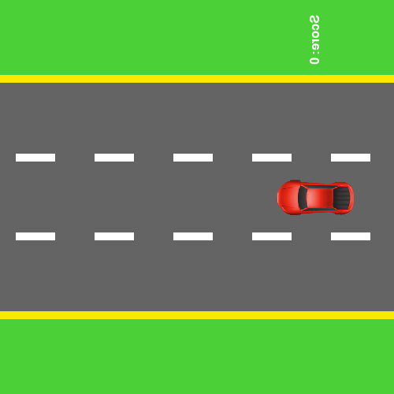

# Car Game by Audric

This repository contains the implementation of a car game developed using Pygame and a DQN (Deep Q-Network) agent for reinforcement learning. The DQN agent learns to play the game by controlling a car that avoids obstacles on a three-lane road.

## Demo
<p align="center">
  
</p>

## Features

- **Pygame Integration**: The game is built using the Pygame library for rendering graphics and handling game logic.
- **Deep Q-Learning**: Uses a DQN agent to learn the optimal policy for controlling the car.
- **Multiple Car Types**: The game includes various car images for different types of vehicles on the road.
- **Speed and Score Management**: Speed increases as the score increases, making the game progressively harder.
- **Game Over Detection**: Detects collisions and ends the game, prompting the user to restart.
- **GIF Generation**: Captures and saves gameplay frames as GIFs for visualization.

## Installation

1. Clone the repository:
    ```bash
    git clone https://github.com/yourusername/cargame.git
    cd cargame
    ```

2. Install the required dependencies:
    ```bash
    pip install -r requirements.txt
    ```

3. Ensure you have the `photos` directory with the necessary images (`car.png`, `pickup_truck.png`, `semi_trailer.png`, `taxi.png`, `van.png`, `crash.png`).

## Usage

To run the game and start training the DQN agent, simply execute the script:

```bash
python CarGameIA.py
```

## Code Overview

### Game Initialization

The game initializes the Pygame environment and sets up the screen, colors, road, and player car coordinates.

### Player and Car Classes

- `Voiture`: A generic car class to represent other cars on the road.
- `PlayerVoiture`: A specialized class for the player's car, which inherits from `Voiture`.

### DQN Agent

The DQN agent is defined in the `DQNAgent` class. It uses a neural network with two hidden layers to predict the Q-values for each action (left, right, stay). The agent explores and exploits the game environment, storing experiences and replaying them to learn the optimal policy.

### Car Game Environment

The `CarGameEnv` class defines the environment, including state representation, step function to take actions, and rendering the game screen.

### Main Training Loop

The main loop runs for a specified number of episodes. In each episode:
1. The environment is reset.
2. The agent takes actions based on the current state.
3. The game environment steps forward based on the action.
4. The agent stores the experience and learns from a random sample of experiences if there are enough in memory.
5. The game captures frames to create a GIF for each episode.

## Training

The game trains the DQN agent over multiple episodes. After each episode, the model and a GIF of the gameplay are saved.

## Dependencies

- Python 3.x
- Pygame
- TensorFlow
- Imageio
- Numpy

Install dependencies using:
```bash
pip install pygame tensorflow imageio numpy
```

## Acknowledgements

- [Pygame](https://www.pygame.org/)
- [TensorFlow](https://www.tensorflow.org/)
- [Imageio](https://imageio.github.io/)

- [CarGame by clickclackcode](https://github.com/clickclackcode/python-car-game.git)